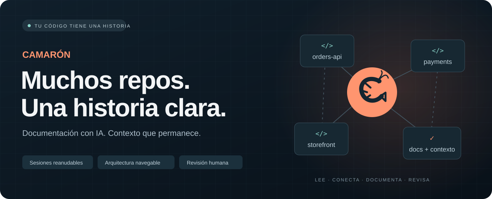
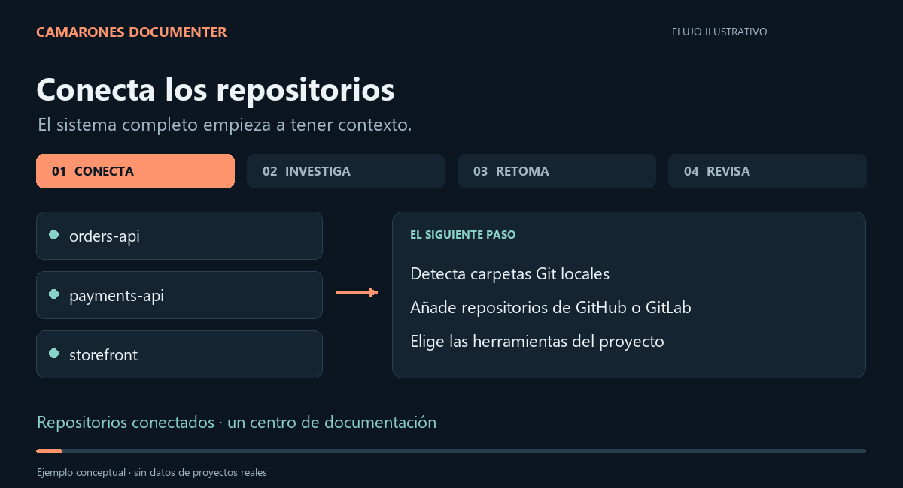

<p align="center">
  
</p>

<p align="center">
  <strong>Convierte un proyecto multi-repo en documentación que puedes explorar, revisar y mantener.</strong><br>
  Tu agente de IA lee el código. Camarones organiza el trabajo. Tú validas el resultado.
</p>

<p align="center">
  
  
  
  
</p>

<p align="center">
  <a href="#empieza-aquí">Empezar</a> ·
  <a href="#del-código-al-mapa-del-proyecto">Cómo funciona</a> ·
  <a href="#una-sesión-una-unidad-de-trabajo">Sesiones</a> ·
  <a href=".camarones/TUTORIAL.md">Tutorial ES / EN</a>
</p>

---

## El código está repartido. La explicación no debería estarlo.

Un servicio recibe la petición, otro publica un evento y un tercero guarda el resultado. Entender el sistema exige cruzar repositorios, conversaciones y decisiones que quizá nadie escribió.

**Camarones Documenter** es un kit local con asistente de terminal y CLI que coordina ese trabajo con Claude Code o Codex. Divide la documentación en unidades manejables, guarda el progreso entre sesiones y reúne el resultado en un portal web.

Está pensado para equipos que necesitan incorporar personas, entender sistemas heredados o documentar la arquitectura y los flujos de un proyecto con varios repositorios.

### Qué hace, en seis puntos

1. **Instala e integra las herramientas de IA** (Claude Code, Codex, graphify, LikeC4, OpenWiki, MCP, mermaid-cli, gitleaks) con un asistente.
2. **Estandariza la documentación** con un plan de unidades, un playbook, convenciones y skills para los agentes.
3. **Las personas consultan, editan y verifican** la documentación en el portal vivo (`camarones up`) o con la CLI.
4. **La IA tiene la documentación a mano al implementar**: servidor MCP `camarones` (`search_docs` con ranking, `read_doc`, `repo_graph`…), servidor MCP `likec4` para preguntar al modelo de arquitectura, ambos en Claude Code y en Codex, y skills `cam-docs-lookup` / `cam-docs-update`.
5. **Documentación viva y revisada**: el código y la doc cambian juntos; `changes`, `check` y la trazabilidad `x-sources` señalan lo que quedó atrás, y `check` además detecta enlaces rotos, diagramas que no se dibujan, secretos copiados y términos que el glosario pide evitar.
6. **Todo vive en `cam-docs/`**, una carpeta junto a tus repos que es su propio repo Git: docs, `.camarones`, `.claude`, `.codex`, `.agents`, `.mcp.json`. Los repos de servicio no reciben archivos del kit.

## Del código al mapa del proyecto

<p align="center">
  
</p>

*Animación explicativa del flujo; no es una grabación de la interfaz ni una medición de tiempos.*

1. **Conecta tus repositorios.** Detecta carpetas Git locales o configura repositorios de GitHub y GitLab.
2. **Descubre el sistema.** El agente examina código, contratos, configuración e integraciones; las entrevistas recogen el contexto que falta.
3. **Documenta por sesiones.** Wikis por repositorio, arquitectura C4, dominio, modelos de datos, flujos de negocio y decisiones.
4. **Revisa y publica.** Valida los borradores y construye un portal con navegación, diagramas y traducciones.
5. **Vuelve cuando cambie el código.** Compara commits desde la última documentación y usa las fuentes para orientar la actualización.

### Lo que lo hace útil

- **Una visión de todo el proyecto.** Une la documentación de cada repositorio con sus relaciones, actores y flujos de negocio.
- **Sesiones que puedes retomar.** Plan, notas de progreso y contexto de relevo guardados en archivos del proyecto.
- **Documentación con fuentes.** Referencias `x-sources` al código y detección de fuentes que ya no existen.
- **Revisión humana visible.** Distingue borradores, páginas confirmadas y páginas que necesitan otra revisión.
- **Arquitectura navegable.** LikeC4 para las vistas del sistema y Mermaid para secuencias, estados y modelos de datos.
- **Documentación para personas y agentes.** Portal para leer; `AGENTS.md`, `CLAUDE.md` y `llms.txt` para orientar el trabajo con IA.
- **Inglés y español.** Documentación canónica en inglés, traducciones al español y seguimiento de traducciones pendientes o desactualizadas.
- **Un primer mapa sin IA.** `arch-draft` realiza un análisis estático y propone un borrador C4 que después hay que verificar.
- **Control de calidad en cada unidad.** Enlaces rotos y diagramas Mermaid inválidos son errores; un posible secreto bloquea el commit de checkpoint, la exportación del portal y la rama de CI, sin mostrar nunca su valor.

## Empieza aquí

### Requisitos

- **Git** y **Node.js 22 o superior** para el conjunto de herramientas.
- **uv**, que gestiona Python 3.10+ y las dependencias del CLI. El lanzador puede instalarlo con WinGet en Windows o Homebrew en macOS; en otros casos indica cómo continuar.
- **Claude Code o Codex**, instalado y autenticado, para las sesiones de documentación con IA. El asistente también permite copiar el prompt.
- **Docker es opcional**: el portal también se puede servir con Python.

El asistente comprueba los requisitos y permite elegir componentes. La primera instalación descarga herramientas y dependencias. El acceso a modelos de IA depende de la configuración y cuenta de tu agente.

### 1. Instala el kit

**Instalación global (recomendada si documentas varios proyectos).** Una sola copia del kit, compartida por todos tus proyectos: actualizarla una vez actualiza el comportamiento en todos a la vez, y cada proyecto solo guarda su propia configuración.

```powershell
# Windows · PowerShell, desde este repo clonado
.\install-global.cmd
```

```sh
# macOS / Linux, desde este repo clonado
sh install-global.sh
```

Esto clona el kit a una ruta fija (`%LOCALAPPDATA%\camarones-documenter\kit` en Windows, `~/.camarones/kit` en macOS/Linux) y deja un comando `camarones` en tu PATH. Desde ahí:

```sh
cd ~/Documents/mi-proyecto   # la carpeta que agrupa (o agrupará) los repos
camarones                    # crea ./cam-docs/, lo registra y abre el asistente
camarones new enjoy          # alternativa: crea ./enjoy/cam-docs/
camarones switch             # cambia entre tus proyectos
camarones self-update        # git pull del kit central — actualiza todos los proyectos a la vez
camarones migrate            # pasa un proyecto de la estructura anterior (≤2.5) a cam-docs/
```

Cada proyecto guarda **todo lo que genera el kit en `cam-docs/`**, un repositorio Git propio (versionado aparte del kit y de los repos que documenta, pensado para compartirlo con el equipo). La carpeta del workspace enlaza a él la configuración de los agentes, así que al abrir Claude Code o Codex en ella ven todos los repos y la documentación:

```text
mi-proyecto/
├── cam-docs/             # Repo Git: la documentación viva y la config de la herramienta
│   ├── .camarones/       # workspace.yaml, PLAYBOOK.md, CONVENTIONS.md (y .cache/, ignorada)
│   ├── .claude/ .codex/ .agents/ .mcp.json   # skills, MCP y reglas para los agentes
│   ├── AGENTS.md CLAUDE.md
│   ├── docs/             # Arquitectura, dominio, flujos, fichas por repo, plan de trabajo…
│   ├── wikis/<repo>/     # Wikis de OpenWiki (el repo ve un enlace openwiki/ sin versionar)
│   └── graph/<repo>/     # Grafo de código de graphify (ignorado)
├── .claude → cam-docs/.claude   .mcp.json → cam-docs/.mcp.json   AGENTS.md → …   CLAUDE.md → …
├── orders-api/           # Repositorio Git, sin archivos del kit
├── payments-api/
└── storefront/
```

Si lo pides, el asistente añade al `CLAUDE.md` de cada repo un bloque corto que apunta a `../cam-docs` (se añade al final; nunca borra lo que había).

**Copia local por proyecto (modo clásico).** Descarga este repositorio desde **Code → Download ZIP** o clónalo. Copia **`.camarones/`**, **`camarones.cmd`** y **`camarones.command`** a la carpeta que agrupa el proyecto. Activa la visualización de archivos ocultos para ver `.camarones/`. Si ya tienes un proyecto así y quieres pasarlo a instalación global sin perder su configuración, corre `camarones unlink` dentro de él.

```text
mi-proyecto/
├── .camarones/           # El kit y su configuración
├── camarones.cmd        # Windows
├── camarones.command    # macOS / Linux
├── orders-api/          # Repositorio Git
├── payments-api/        # Repositorio Git
└── storefront/          # Repositorio Git
```

También puedes empezar con la carpeta vacía y añadir repositorios desde el asistente. La carpeta contenedora será el centro de documentación; los repositorios de servicio conservan su propio historial Git.

### 2. Abre el asistente

**Instalación global** — desde la carpeta del workspace o cualquier carpeta dentro de ella (o corre `camarones switch` para elegir un proyecto):

```sh
camarones
```

**Copia local (modo clásico)**

**Windows · PowerShell**

```powershell
.\camarones.cmd
```

**macOS / Linux**

```sh
sh camarones.command
```

En Windows también puedes abrir `camarones.cmd` con doble clic. En macOS, si el sistema bloquea el lanzador descargado, ejecútalo una primera vez desde Terminal con el comando anterior.

### 3. Sigue el plan

Configura el proyecto, selecciona repositorios y componentes, prepara el entorno y elige el siguiente paso. Camarones prepara las instrucciones de cada unidad para el agente. Revisa los resultados antes de confirmarlos.

> **Si estás desarrollando el kit:** utiliza `uv run --script .camarones/camarones.py wizard` para abrir el asistente explícitamente. Al ejecutar sin argumentos desde una carpeta llamada `camarones-documenter*` o `camarones-kit*`, el lanzador contempla instalar el kit en la carpeta superior. Prueba los flujos de instalación en una carpeta de ejemplo separada.

## Una sesión, una unidad de trabajo

La documentación profunda de un sistema no suele caber en una sola conversación. Camarones mantiene un plan con dependencias y unidades como `discovery:orders-api`, `arch-system` o `flow:checkout`.

Cada sesión lee el contexto necesario, trabaja en una unidad y guarda notas. Si se interrumpe, el siguiente agente puede continuar desde el último checkpoint. Al cerrar o bloquear una unidad, el CLI intenta crear un commit local del progreso cuando la carpeta contenedora ya tiene Git configurado.

```powershell
# Ver el trabajo disponible
.\camarones.cmd plan next

# Empezar una unidad existente y guardar una nota
.\camarones.cmd plan start discovery:orders-api
.\camarones.cmd plan note discovery:orders-api "Revisados endpoints; falta mensajería"

# Obtener instrucciones para una sesión de actualización
.\camarones.cmd prompt update --lang es
```

En macOS / Linux, sustituye `.\camarones.cmd` por `sh camarones.command` en los ejemplos.

## La IA propone. Tú confirmas.

La revisión se aplica al contenido exacto de cada página:

- **`draft`**: todavía no tiene validación humana.
- **`confirmed`**: una persona confirmó ese contenido; la confirmación queda asociada a su hash.
- **`needs-reconfirm`**: la página fue confirmada, pero su contenido cambió después.

Las convenciones instruyen a los agentes para conservar los bloques `<!-- human -->` y respetar los archivos con `x-owner: human`. Son reglas de trabajo para el agente; la calidad final sigue requiriendo revisión.

```powershell
.\camarones.cmd status
.\camarones.cmd check
.\camarones.cmd confirm docs/overview/system.md --by "Tu nombre"
.\camarones.cmd feedback docs/overview/system.md "Falta describir los reintentos" --by "Tu nombre"
```

`check` es la puerta de calidad que se pasa al cerrar cada unidad y en CI:

| Comprobación | Gravedad | Herramienta |
|---|---|---|
| Frontmatter ausente, fuentes `x-sources` que ya no existen | ERROR | — |
| Enlace roto a otra página, resuelto igual que en el portal | ERROR | Python (sin dependencias) |
| Diagrama Mermaid que no se dibuja | ERROR | mermaid-cli |
| Posible secreto en `docs/` o en una wiki | ERROR; bloquea checkpoint y `portal` | gitleaks |
| Palabra de la columna **Avoid** del glosario | aviso (ERROR con `--strict`) | Python (sin dependencias) |
| Página confirmada que cambió · traducción pendiente | aviso | — |

mermaid-cli y gitleaks forman el componente `quality` del perfil completo; si faltan, `check` lo avisa una vez y sigue con el resto. `check --secrets` ejecuta solo el escaneo de secretos.

## Todo termina en archivos que puedes versionar

```text
mi-proyecto/cam-docs/
├── docs/
│   ├── overview/        # Visión general del sistema
│   ├── architecture/    # Modelo C4 y vistas
│   ├── domain/          # Contextos, actores y glosario
│   ├── flows/           # Flujos de negocio y secuencias
│   ├── data/            # Modelos y propiedad de los datos
│   ├── deployment/      # Entornos y despliegue
│   ├── decisions/       # Decisiones de arquitectura
│   ├── quality/         # SLAs y deuda técnica
│   ├── interview/       # Respuestas y preguntas abiertas
│   ├── i18n/es/         # Traducciones al español
│   ├── .work/           # Plan, checkpoints y relevo entre sesiones
│   └── llms.txt         # Índice para agentes
├── wikis/orders-api/    # Wiki del repositorio, si se eligió OpenWiki
├── AGENTS.md
└── CLAUDE.md
```

### Explora y edita en el portal

```sh
camarones up          # portal local: leer, editar, confirmar, pedir cambios, generar wikis y hacer commit en cam-docs
camarones wiki orders-api   # generar o actualizar la wiki OpenWiki de un repo (lo mismo que la pestaña Wikis)
camarones down
```

Abre **http://localhost:8080**. Es un único portal 🦐 con pestañas, en español o inglés (el mismo selector cambia la interfaz y las traducciones de la documentación):

- **Docs**: lee `cam-docs/docs` en el momento (sin build, sin Docker). Cada página muestra su estado (`draft`, `confirmed`, `needs-reconfirm`), y desde ahí puedes editarla, confirmarla, crear páginas o dejar un comentario para la siguiente sesión de IA. Incluye búsqueda de texto completo.
- **Architecture (C4)**: el explorador LikeC4, con botón para reconstruirlo.
- **Code graph**: el grafo de graphify de todos los repos o de uno.
- **Wikis**: estado de la wiki OpenWiki de cada repo, su grafo, y el botón para generarla o actualizarla con un log en vivo. Sin clave de proveedor de OpenWiki, la genera Claude Code o Codex a través del MCP de OpenWiki.
- **Review**: lo pendiente de revisar, las peticiones de cambio y los repos cuyo código cambió.

Para publicarlo (CI / hosting), `camarones portal` exporta la misma aplicación en modo solo lectura (HTML + JSON, sin npm) a `.camarones/.cache/site`. Se sirve con `camarones up --static`, con `camarones up --docker` o desde cualquier hosting estático; los enlaces «Editar» llevan al fichero en GitLab/GitHub.

### Mantenlo al día

```powershell
.\camarones.cmd changes
.\camarones.cmd prompt update --lang es
.\camarones.cmd check
```

`changes` compara los commits con el estado registrado en la última documentación. `prompt update` **imprime instrucciones**: entrégaselas a tu agente o inicia la actualización desde el asistente. Después del trabajo y la revisión, `mark-documented` registra el nuevo punto de referencia.

Se incluyen [plantillas de CI para GitHub y GitLab](.camarones/ci/) para automatizar actualizaciones y construir el portal. Antes de abrir la PR/MR ejecutan `check --secrets`: si la IA copió un secreto en la documentación, el job falla y la rama no se publica. Requieren configurar accesos, secretos y despliegue según el proyecto; no se activan al descargar este repositorio.

## Las piezas del kit

**Python + Rich + Questionary** construyen el asistente y la CLI. **uv** resuelve su entorno. **OpenWiki** se encarga de las wikis por repositorio, **graphify** del grafo de código y **LikeC4** del modelo de arquitectura (también como servidor MCP para los agentes). **mermaid-cli** valida los diagramas y **gitleaks** busca secretos antes de cada commit y de publicar; gitleaks se descarga de su release oficial con la suma SHA-256 verificada. El portal es una aplicación propia sin build (**marked**, **DOMPurify** y **Mermaid**, servidos en local). El despliegue con contenedor utiliza **nginx**.

Las versiones de las herramientas están fijadas en [common.py](.camarones/lib/common.py) y las librerías del portal en [serve.py](.camarones/lib/serve.py). Puedes consultarlas con:

```powershell
.\camarones.cmd version
.\camarones.cmd doctor
```

## Herramientas que evaluamos y descartamos

Antes de añadir una herramienta, la comparamos con los criterios del kit: funciona en local y sin enviar código fuera, no deja archivos en los repos de servicio, sirve igual con Claude Code y con Codex, funciona en macOS, Windows y Linux, y pesa poco (preferimos Python estándar, `uv` o npm con versión fija). El análisis completo, con un identificador por candidata, está en [tooling-candidates.md](docs/research/tooling-candidates.md).

**Sustituidas al implementar** (el hueco se cubrió de forma más ligera):

| Herramienta | Por qué no |
|---|---|
| lychee | La comprobación de enlaces está escrita en Python estándar: resuelve los enlaces igual que el portal y no añade ningún binario. |
| Vale | Su valor dependía de una lista de sinónimos prohibidos; con la columna **Avoid** del glosario basta una búsqueda en Python. Además no trae diccionario en español. |
| SQLite FTS5 | Un índice incremental tendría que leer todos los ficheros en cada consulta para saber qué cambió. La búsqueda BM25 en memoria da el mismo ranking sin caché ni problemas de concurrencia. |
| mermaid-cli 12 | Usa mermaid 12 y el portal dibuja con mermaid 11: se fija mermaid-cli 11.x para validar con el mismo motor. |
| `npx skills add` (skill de LikeC4) | Canal de distribución sin versión fija. El servidor MCP de LikeC4 sí está integrado; la skill queda pendiente hasta poder guardar una copia revisada. |

**Descartadas en el análisis:**

| Herramientas | Por qué no |
|---|---|
| DeepWiki, Google Code Wiki, Swimm, Mintlify, GitBook, DeepDocs, NotebookLM, Context7, DeepL, IcePanel | Servicios en la nube: el código o la documentación salen de la máquina. |
| Structurizr, D2, Kroki | Otra notación u otro motor de diagramas además de LikeC4 y Mermaid; cambiar tiene un coste alto. |
| Zensical, Astro Starlight, Docusaurus, VitePress, Quartz | El portal propio ya cubre esto sin paso de build ni npm; quien prefiera Obsidian puede abrir `cam-docs/docs` como vault sin integración del kit. |
| log4brains | Duplicaría el visor de ADR que ya tiene el portal. |
| CodeGraphContext, Zoekt, indexadores SCIP | Necesitan un servidor, una base de datos de grafos o que los repos compilen: demasiado para un kit local. |
| RepoWiki | Proyecto pequeño y de madurez desconocida. |
| jQAssistant, Spring Modulith Documenter, dependency-cruiser, Madge | Solo sirven para un lenguaje o framework concreto. |
| SchemaSpy, Atlas | tbls cubre lo mismo con salida en Markdown y Mermaid. |
| KubeDiagrams | Genera imágenes, no un modelo LikeC4. |
| Spectral, AsyncAPI CLI | Solo tienen sentido si antes se generan contratos OpenAPI/AsyncAPI desde el código. |
| sqlite-vec | Exige un modelo de embeddings para una mejora pequeña sobre la búsqueda actual. |
| Egon.io, OWASP Threat Dragon | Herramientas manuales de taller; un agente no puede conducirlas. |
| po4a, mdpo | Flujo de traducción pensado para traductores humanos; excesivo para dos idiomas. |
| mani, gita | `workspace.yaml` y `sync` ya gestionan los repos. |
| GitHub Spec Kit, Task Master | Otro objetivo: construir funcionalidades, no documentar. |

**Aplazadas, no descartadas:** codebase-memory-mcp o GitNexus (grafo de código con impacto entre repos), tbls (esquema real de las bases de datos), el service graph de OpenTelemetry (relaciones observadas en producción) y CodeWiki (wikis de repos muy grandes). Merecen una prueba en un proyecto real antes de decidir. El resto de candidatas marcadas como «worth a look» siguen en el análisis sin decisión.

## Sigue explorando

- [Tutorial en español e inglés](.camarones/TUTORIAL.md): qué hace cada herramienta y cómo encajan.
- [Guía de comandos en español](.camarones/templates/docs/i18n/es/guides/tutorial.md): referencia de uso que el kit instala en cada proyecto.
- [Playbook de los agentes](.camarones/PLAYBOOK.md): trabajo y entregables de cada sesión.
- [Convenciones de documentación](.camarones/CONVENTIONS.md): fuentes, revisión, diagramas y traducciones.
- [CLI principal](.camarones/camarones.py): comandos disponibles y punto de entrada.

¿Has encontrado un problema o tienes una idea? Abre un issue con el contexto, tu sistema operativo, la salida de `version` y los pasos para reproducirlo, sin incluir tokens ni datos privados.

---

<p align="center"><em>🦐 Camarón que se duerme, se lo lleva la corriente.<br>Guarda el contexto. Retoma el trabajo. Entiende el sistema.</em></p>
